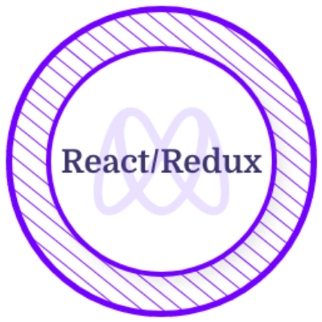

<h3 align="center"> I'm a software developer living in Saudi Arabia!</h3>

I have learned software development from Microverse. I can speak in <strong>four languages</strong> (Arabic, English, Tigrina & Amharic). I spend most of my time learning different frameworks and technologies related to web development.

- 👩‍💻 I’m a **Junior Full-Stack Software Developer** trained in a remote, collaborative and multicultural environment at [Microverse.](https://github.com/microverseinc)

- 🌱 I’m currently looking to get hired as a junior back-end, front-end or full-stack developer.

- 💻 All **my projects** are available [here.](https://github.com/NatiG25?tab=repositories)

### 🎯 Reach me on:

- Twitter: [@NatiG255](https://twitter.com/NatiG255)
- Linkedin: [Nati](https://www.linkedin.com/in/natigorgis/)
- Email: nati.g5684@gmail.com

<h2 align="left">Skills</h2>

  &nbsp; &nbsp; &nbsp; &nbsp;  &nbsp;  &nbsp;  &nbsp;  &nbsp; &nbsp; &nbsp; &nbsp; &nbsp; &nbsp; &nbsp; &nbsp; &nbsp; &nbsp; &nbsp; &nbsp; &nbsp; 

<h2 align="left">Certificates & Licenses</h2>

&nbsp; &nbsp; &nbsp; &nbsp;  &nbsp;  &nbsp;  &nbsp;  &nbsp;  &nbsp;  &nbsp; 

<!--
**NatiG25/NatiG25** is a ✨ _special_ ✨ repository because its `README.md` (this file) appears on your GitHub profile.
